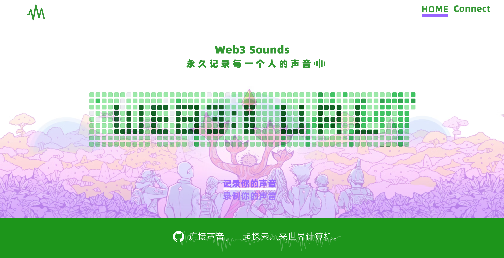

# Web3Sounds 微波山之声

> 点亮那些在互联网海洋中消失的微波或音符，接力让每一个人的声音有能被听到、被珍惜。

## 项目简介

- **产品名字**：Web3Sounds 微波山之声
- **产品初心**：在这个信息繁杂、声音喧嚣的互联网时代，许多重要的声音却常常被淹没。在我们构思这款产品时，初衷是希望能够为每一个人提供一个永久在区块链上记录声音的开源工具。**除了发声的记录，更是同频的连接。**不仅能连接个体多元的声音，更能像微波一样，将这些声音串联起来，形成一个充满活力和能量的**多样性声音集**。
- **目标用户**：产品面向所有希望匿名记录和分享自己声音的用户，用户可以上传或录制他们想要记录的声音，无论是一个词、一句话还是一段音乐，你想让更多人听到的声音。

## 核心功能

- **发声记录**：我们相信，每个人的声音都是独一无二的，承载着个人的情感、经历和思想。因此，用户通过Web3Sounds 可以匿名地上传或录制他们想要记录的声音到相应的区块链平台，可以是一句话、一个词，一段音乐。这不仅是个人表达的延伸，更是对内心声响的一种回应与探索。
- **同频连接：** 这是一个由大家共同创造和定义的声音集空间，不仅能连接个体多元的声音，更能像微波一样，将这些声音串联起来，形成一个充满活力和能量的**多样性声音集**，比如：Web3URL残酷学习的声音、以太坊生态的声音、公共物品的声音、NFT 艺术相关的声音、大自然的声音等等，通过某种**有趣的算法**，让它们以全新的方式呈现在这个丰富多彩的未来世界中。

## 技术方案

- 前端技术：React
- 智能合约：FlatDirectory Contract
- 存储解决方案：使用 EthStorage L2 存储声音文件及其相关属性。
- 用户通过产品上传音频文件存储到flat合约文件夹中，用户对文件享有绝对控制权，可以决定是否分享到公共区域
- 在合约中调用AI分析， 对文件信息进行分类，为每一份音频做内容标记，相关联的音频内容基于推荐算法推送到用户端，不同的用户喜好会收到不同的内容推送
- 采用UUPS模式进行代理合约升级，并优化音频文件数据存储方式，在合约升级时可回调转移数据，保障原有数据平稳迁移
- 通过修饰符实施访问控制，限制关键函数的调用权限
- 使用重入锁(如ReentrancyGuard)防止重入攻击
- 合约测试覆盖率100%

## 开发与测试 Demo 

- 目前产品处于 Demo 阶段：
  - **声音记录功能**
    - **声音上传：** 实现声音的上传功能，上传的时候可以选择相关属性对声音进行描述。
    - **声音录制：** 实现声音的录制并上传功能，上传的时候可以选择相关属性对声音进行描述。
    - **声音存储：** 声音会根据相关属性存储在 EthStorage L2 里。
  - **声音图景展示**
    - **千人千面声音集**：目前 Demo 版以 GitHub 热力图 + Web3 URL 字母图景进行设计。默认情况这些声音都是自发不同的人，通过后台算法将这些不同地方的人的相同的声音连接集合起来形成某种个性的声音集。未来图景构想会千人千面，更有趣。
    - **动态效果**：当用户访问页面时，图景随机生成，不同的布局和颜色搭配使得每次访问都形成独特的视觉体验。
      - 单个声音图标设计
      - 由声音图标构成一幅图景，或者围绕图景规律性分布
    - **声音播放功能**
      - **点击事件**：当用户点击某个节点时，播放与该节点相关联的声音。
      - **声音切换**：实现声音的淡入淡出效果，提高用户体验。
    - **互动功能**
      - **长按互动**：可以设计为长按某个节点后，弹出一个选项（如点赞、收藏、分享等）。
      - **未来扩展**：考虑更丰富的互动形式，比如用户可以为声音留言，接力。

## 共创团队

基于 LXDAO X EthStorage Web3URL 残酷共学 1st

**发起者：**[Oscar](https://github.com/luffythink) 主产品设计、[Derick](https://github.com/DerickIT) 主智能合约设计、[Cora](https://github.com/CHENFANGC) 主前端 

**Demo 链接：**

**产品共创记录**：

- [产品进度及共创记录](https://github.com/luffythink/Web3Sounds/blob/main/w3doc/%E4%BA%A7%E5%93%81%E5%85%B1%E5%88%9B%E8%AE%B0%E5%BD%95.md)
- [用户旅程](https://github.com/luffythink/Web3Sounds/blob/main/w3doc/User_journey.md)

## 未来计划

- **连接更多共创者**：本产品开源开放，每一个认同此产品愿景的小伙伴，都可以加入进来 Buidl it，共同推动 Web3Sounds 的可持续建设。
- **基于 Web3 URL 友好访问**：未来将继续完善功能，提升用户体验，并探索更多基于声音的连接和互动形式。

